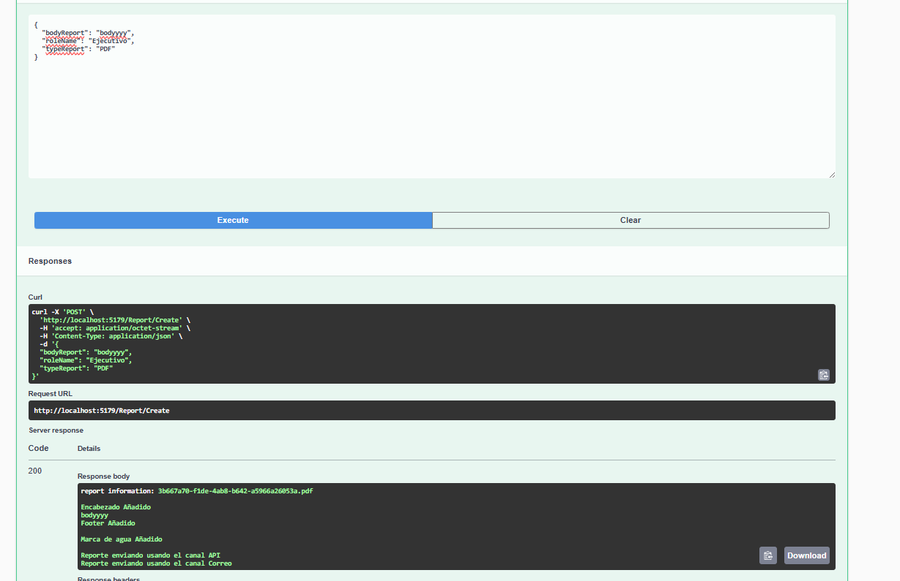

# **PROYECTO FINAL MODULO 1**

## Descipcion:

Creacion de reportes mediante roles (estrategia), tipo de reportes (PDF, Excel, etc),
Ademas de la posibilidad de decorar el reporte y ponerle cifrado, encabezado,
footer o marca de agua, para finalizar se puede enviar mediante algun canal (API, Correo).

Los decoradores de reportes se basan en el rol, mientras el rol sea mas alto (Ejecutivo)
el reporte es mas completo.

---

- BodyReport: aqui se pone lo que va a ir dentro del reporte, es decir la informacion del cuerpo
- RoleName: el tipo de usuario Ejecutivo, Analista, etc (Se peude agregar mas estrategias)
- TypeReport: el tipo de reporte a crear PDF, Excel (Se puede agregar mas en el factory)
---
- Response: aqui se puede ver el resultado, da el reporte completo, con la informacion, ademas de mediante que canal se envio

---
## Informacion
por el momento solo se puede usar el rol de ejectuvo y analista (en base a eso se agregan los decoradores en las estrategias),
existe solo 2 tipos de reportes PDF y Excel.
En ambos casos se puede agregar mas porque dependen de abstracciones (es decir interfaces)

---
## Uso
Ejecutar dotnet run y acceder a swagger
